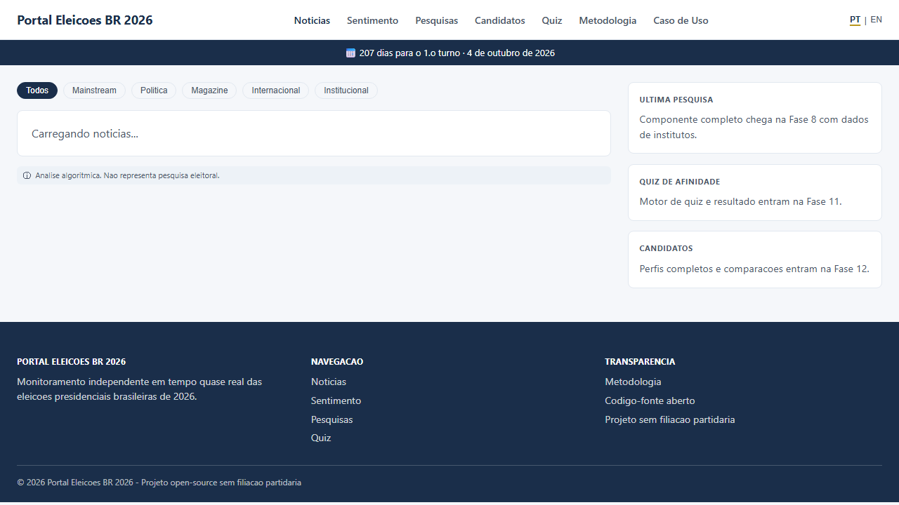

# Portal Eleicoes BR 2026

[](https://github.com/carlosduplar/eleicoes-2026-monitor/actions/workflows/collect.yml)
[](https://github.com/carlosduplar/eleicoes-2026-monitor/actions/workflows/deploy.yml)
[](https://github.com/carlosduplar/eleicoes-2026-monitor/actions/workflows/watchdog.yml)

> Live: https://carlosduplar.github.io/eleicoes-2026-monitor/

## What is this? / O que e isto?

Portal Eleicoes BR 2026 is a bilingual static portal (pt-BR and en-US) that monitors election news, sentiment, polling, and candidate positioning signals for Brazil's 2026 presidential cycle. It combines a Python ingestion pipeline, AI-assisted enrichment, and a React + Vite SSG frontend published to GitHub Pages.

O Portal Eleicoes BR 2026 e um portal estatico bilingue (pt-BR e en-US) para monitorar noticias, sentimento, pesquisas e sinais de posicionamento de candidatos na eleicao presidencial de 2026. O projeto combina pipeline Python de ingestao, enriquecimento com IA e frontend React + Vite SSG publicado no GitHub Pages.

## Screenshot



## Architecture

```text
Sources (RSS, polls, parties, social)
                |
                v
      scripts/collect_*.py  (Foca, ~10 min)
                |
                v
   scripts/summarize.py + analyze_sentiment.py
           (Editor, ~30 min)
                |
                v
    scripts/curate.py + quiz extraction
        (Editor-chefe, ~90 min)
                |
                v
 data/*.json  -> schema validation -> git commit
                |
                v
 React + Vite + vite-plugin-ssg (site/)
                |
                v
      GitHub Pages + Cloudflare CDN
```

## Running Locally

```powershell
# from repository root
pip install -r requirements.txt

Push-Location site
npm install
npm run dev
Pop-Location
```

```powershell
# run data pipeline scripts from root
python scripts/collect_rss.py
python scripts/build_data.py
python scripts/curate.py
```

```powershell
# tests
python -m pytest scripts/ -v --tb=short
Push-Location site
npx playwright install chromium
npx playwright test
Pop-Location
```

## Required GitHub Secrets

| Secret | Used by | Description |
|---|---|---|
| `BRIGHTDATA_API_KEY` | `collect.yml` | Bright Data API key for fallback scraping |
| `BRIGHTDATA_ZONE` | `collect.yml` | Bright Data zone identifier |
| `NVIDIA_API_KEY` | `collect.yml`, `validate.yml`, `curate.yml`, `update-quiz.yml` | NVIDIA NIM provider |
| `OPENROUTER_API_KEY` | `collect.yml`, `validate.yml`, `curate.yml`, `update-quiz.yml` | OpenRouter provider |
| `OLLAMA_API_KEY` | `collect.yml`, `validate.yml`, `curate.yml`, `update-quiz.yml` | Ollama Cloud provider |
| `VERTEX_ACCESS_TOKEN` | `collect.yml`, `validate.yml`, `curate.yml`, `update-quiz.yml` | Vertex/Gemini access token |
| `VERTEX_BASE_URL` | `collect.yml`, `validate.yml`, `curate.yml`, `update-quiz.yml` | Vertex/Gemini endpoint base URL |
| `XIAOMI_MIMO_API_KEY` | `collect.yml`, `validate.yml`, `curate.yml` | MiMo fallback provider |
| `TWITTER_BEARER_TOKEN` | `collect.yml` | Social collection token |
| `YOUTUBE_API_KEY` | `collect.yml` | YouTube collection key |

## Pre-candidates (March 2026)

| Name | Party | Status |
|---|---|---|
| Luiz Inacio Lula da Silva | PT | pre-candidate |
| Flavio Nantes Bolsonaro | PL | pre-candidate |
| Tarcisio Gomes de Freitas | Republicanos | speculated |
| Ronaldo Ramos Caiado | Uniao Brasil | pre-candidate |
| Romeu Zema Neto | Novo | pre-candidate |
| Carlos Roberto Massa Junior | PSD | speculated |
| Eduardo Figueiredo Cavalheiro Leite | PSD | pre-candidate |
| Jose Aldo Rebelo Figueiredo | DC | pre-candidate |
| Renan Franco Santos | Missao | pre-candidate |

## Architecture Decision Records

- [ADR-000: Wireframes](docs/adr/000-wireframes.md)
- [ADR-001: Hosting](docs/adr/001-hosting.md)
- [ADR-002: AI Providers](docs/adr/002-ai-providers.md)
- [ADR-003: i18n Strategy](docs/adr/003-i18n-strategy.md)
- [ADR-004: SEO and GEO Strategy](docs/adr/004-seo-geo-strategy.md)
- [ADR-005: Quiz Affinity System](docs/adr/005-quiz-affinity-system.md)
- [ADR-006: Transparency and Methodology](docs/adr/006-transparency-methodology.md)

## Contributing

Open a GitHub issue describing the bug/feature and the expected behavior before opening a pull request.

## License

MIT
