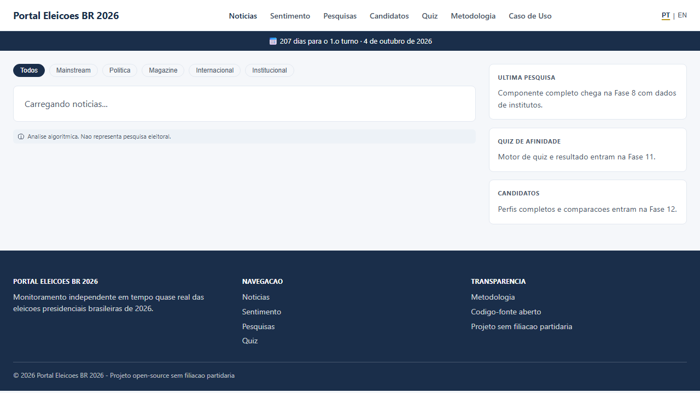

# Portal Eleicoes BR 2026

[](https://github.com/carlosduplar/eleicoes-2026-monitor/actions/workflows/collect.yml)
[](https://github.com/carlosduplar/eleicoes-2026-monitor/actions/workflows/deploy.yml)
[](https://github.com/carlosduplar/eleicoes-2026-monitor/actions/workflows/watchdog.yml)

> Live: https://carlosduplar.github.io/eleicoes-2026-monitor/

## What is this? / O que e isto?

Portal Eleicoes BR 2026 is a bilingual static portal (pt-BR and en-US) that monitors election news, sentiment, polling, and candidate positioning signals for Brazil's 2026 presidential cycle. It combines a Python ingestion pipeline, AI-assisted enrichment, and a React + Vite SSG frontend published to GitHub Pages. The product is designed as auditable editorial infrastructure: readers can inspect methodology, processing status, sources, and the technical path that produced each public artifact.

O Portal Eleições BR 2026 é um portal estático bilíngue (pt-BR e en-US) para monitorar notícias, sentimento, pesquisas e sinais de posicionamento de candidatos na eleição presidencial de 2026. O projeto combina pipeline Python de ingestão, enriquecimento com IA e frontend React + Vite SSG publicado no GitHub Pages. O produto foi concebido como infraestrutura editorial auditável: o público consegue inspecionar metodologia, status de processamento, fontes e o caminho técnico que levou cada artefato ao ar.

## Screenshot



## Architecture

```text
Sources (21 RSS, 8 party sites, 10 polling institutes, YouTube)
                |
                v
      scripts/collect_*.py  (Foca, ~10 min)
                |
                v
        raw articles + editor feedback sync/prune
                |
                v
   scripts/summarize.py + analyze_sentiment.py
           (Editor, ~30 min)
                |
                v
  validated articles + bilingual summaries
                |
                v
    scripts/curate.py + quiz extraction
        (Editor-chefe, ~90 min)
                |
                v
 curated articles / irrelevant purge
                |
                v
 site/public/data/*.json + state/  -> git commit
        (published)      (internal, never served)
                |
                v
 React + Vite + vite-plugin-ssg (site/)
                |
                v
      GitHub Pages + Cloudflare CDN
```

Publication states are explicit in the data: `raw -> validated -> curated`, plus `irrelevant` for items automatically filtered out of the public feed. The public news feed (`site/src/components/NewsFeed.jsx`) displays only `validated` + `curated` articles (since 2026-08-30); `raw` items remain in `site/public/data/articles.json` for audit/reprocessing but are hidden from the reader. The green "Validado / Validated" badge was removed because it was redundant once every visible card is validated — only the category badge and the gold "Destaque da Redação / Editor's Highlight" (`curated`) badge remain.

## CI execution and scraping fallbacks

The scheduled `collect.yml` and `validate.yml` jobs are tuned for GitHub-hosted runners:

- Both workflows use a shallow checkout (`fetch-depth: 1`) because they only need the current tree and the latest remote state before publishing.
- Bright Data Web Unlocker is the primary HTML fetcher for article and poll collection. The workflow probe uses the same REST endpoint and zone as production and is informational only, so a transient probe failure cannot trigger a long browser-install step.
- Playwright is a fallback only. Article and poll collectors launch the runner's preinstalled Google Chrome (`channel: "chrome"`) lazily, only after Bright Data fails. GitHub Actions no longer downloads a Playwright browser bundle on every run.
- AI requests have a 45-second client timeout with SDK retries disabled; the provider fallback chain can take over instead of waiting through repeated long-tail retries.
- Quiz workflows set `AI_PREFLIGHT_ENABLED=1` to run an 8-second streaming preflight that measures TTFT and total latency, then reuse the fastest healthy free model for the run. Leave it unset or set it to `0` to keep static chain order; set `AI_PREFLIGHT_INCLUDE_PAID=1` to include paid providers in selection.

The workflows still share the `repo-write-${{ github.ref }}` concurrency group with the other data-writing jobs. This protects commits but can queue an entire job; moving the lock to a short commit-only job would require a separate artifact/merge design.

For local browser tests, install the Python Playwright browser explicitly with `python -m playwright install chromium`. The CI fallback uses system Chrome and does not depend on that download.

## Methodology and use case highlights / Metodologia e caso de uso

- Independent project with no party affiliation or electoral funding; methodology, limitations, and error reporting are part of the product surface.
- Newsroom-style pipeline with three automated roles: `Foca` (collection), `Editor` (validation/summarization), and `Editor-chefe` (curation/prominence).
- AI fallback chain (all tasks): Poolside (Laguna S 2.1, reasoning enabled) -> Ollama Cloud (MiniMax M3) -> NVIDIA NIM (MiniMax M3) -> OpenRouter/free.
- Circuit breaker and per-run AI call limits keep the pipeline running when providers degrade instead of failing closed.
- Editorial feedback is self-healing: blocked keywords, URLs, sources, and `irrelevant` article IDs are accumulated in `state/editor_feedback.json`.
- The public quiz only reveals sources in the result view, never during the questions.
- Public topic IDs use `politica_externa` for foreign policy. `eleicoes` remains an article-level relevance tag, not a candidate-position or quiz topic.

## Running Locally

```powershell
# from repository root
pip install -r requirements.txt

Push-Location site
npm install
npm run dev
Pop-Location
```

```powershell
# run data pipeline scripts from root
python scripts/collect_rss.py
python scripts/build_data.py
python scripts/curate.py
```

```powershell
# tests
python -m pytest scripts/ -v --tb=short
Push-Location site
npx playwright install chromium
npx playwright test
Pop-Location
```

## Editorial feedback loop (self-healing)

The ingestion pipeline now supports an editorial feedback file: `state/editor_feedback.json` (committed for auditability, not served on the site).

- Mark an article as irrelevant by setting `"status": "irrelevant"` in `site/public/data/articles.json`.
- On each collect run, `scripts/sync_editor_feedback.py` stores those article IDs in `editor_feedback.json`, and `scripts/editor_feedback.py --execute` prunes IDs idle for more than 90 days (each ID carries a last-confirmed timestamp; rule lists are never pruned).
- `scripts/collect_rss.py` skips URLs/IDs/sources/title patterns present in that file.
- `scripts/build_data.py` publishes only non-irrelevant articles and keeps the feedback list updated.

You can also add manual rules in `editor_feedback.json`:

- `blocked_title_keywords`
- `blocked_url_substrings`
- `blocked_sources`

This mechanism is part of the project's transparency model: irrelevant content is filtered automatically, but the filtering rules remain visible and auditable in the repository.

## Article Archiving

`site/public/data/articles.json` uses a tiered retention strategy to keep the file manageable as articles accumulate:

| Tier | Default Age | Behavior |
|------|-------------|----------|
| **Hot** | 0–7 days | Full article retained (all fields including `content`) |
| **Warm** | 7–30 days | `content` field stripped, metadata + summaries preserved |
| **Cold** | 30+ days | Moved to `site/public/data/archives/YYYY-MM.json`, removed from main file |

Curated articles (`status: "curated"`) get an extra 7 days of hot retention (14 total) since they have been manually reviewed.

```powershell
# Preview what would change (dry-run, default)
python scripts/archive_articles.py

# Apply changes
python scripts/archive_articles.py --execute

# Custom thresholds
python scripts/archive_articles.py --execute --hot-days 14 --warm-days 60
```

Archive files in `site/public/data/archives/` follow the same schema as `articles.json` and are committed alongside the main data files. The archiving step runs automatically in the `collect.yml` workflow after `build_data.py`.

## Required GitHub Secrets

| Secret | Used by | Description |
|---|---|---|
| `BRIGHTDATA_API_KEY` | `collect.yml` | Bright Data API key for fallback scraping |
| `BRIGHTDATA_ZONE` | `collect.yml` | Bright Data zone identifier |
| `POOLSIDE_API_KEY` | `collect.yml`, `validate.yml`, `curate.yml`, `update-quiz.yml`, `update-candidates-positions.yml` | Poolside provider (Laguna S 2.1, primary) |
| `NVIDIA_API_KEY` | `collect.yml`, `validate.yml`, `curate.yml`, `update-quiz.yml`, `update-candidates-positions.yml` | NVIDIA NIM provider |
| `OPENROUTER_API_KEY` | `collect.yml`, `validate.yml`, `curate.yml`, `update-quiz.yml`, `update-candidates-positions.yml` | OpenRouter provider |
| `OLLAMA_API_KEY` | `collect.yml`, `validate.yml`, `curate.yml`, `update-quiz.yml`, `update-candidates-positions.yml` | Ollama Cloud provider |
| `TWITTER_BEARER_TOKEN` | `collect.yml` | Social collection token |
| `YOUTUBE_API_KEY` | `collect.yml` | YouTube collection key |

The methodology page and case study document the current preferred AI provider order for public transparency. The table above lists the secrets referenced by workflows in this repository.

## Official candidates (TSE — registro protocolado até 2026-08-15)

> 13 candidaturas à Presidência protocoladas no TSE até 19h de 2026-08-15 (fonte: TSE DivulgaCandContas via G1/Agência Brasil 2026-08-17; julgamento virtual a partir de 2026-08-31). Lista oficial substitui a lista especulativa de 9 pré-candidatos de março de 2026.

| Name | Party | Status | Photo |
|---|---|---|---|
| Luiz Inácio Lula da Silva | PT | pre-candidate |  |
| Flávio Nantes Bolsonaro | PL | pre-candidate |  |
| Renan Franco Santos | Missão | pre-candidate |  |
| Ronaldo Ramos Caiado | PSD | pre-candidate |  |
| Augusto Cury | Avante | pre-candidate |  |
| Romeu Zema Neto | Novo | pre-candidate |  |
| Edmilson Costa | PCB | pre-candidate |  |
| Hertz Dias | PSTU | pre-candidate |  |
| Samara Martins | UP | pre-candidate |  |
| Wilson Grassi | Democrata | pre-candidate |  |
| Clariana Zacarkim Barão | DC | pre-candidate |  |
| Rui Costa Pimenta | PCO | pre-candidate |  |
| Pablo Marçal | PRTB | pre-candidate |  |

## Architecture Decision Records

- [ADR-000: Wireframes](docs/adr/000-wireframes.md)
- [ADR-001: Hosting](docs/adr/001-hosting.md)
- [ADR-002: AI Providers](docs/adr/002-ai-providers.md)
- [ADR-003: i18n Strategy](docs/adr/003-i18n-strategy.md)
- [ADR-004: SEO and GEO Strategy](docs/adr/004-seo-geo-strategy.md)
- [ADR-005: Quiz Affinity System](docs/adr/005-quiz-affinity-system.md)
- [ADR-006: Transparency and Methodology](docs/adr/006-transparency-methodology.md)

## Learn more / Saiba mais

- [Methodology ADR](docs/adr/006-transparency-methodology.md)
- [Case study (pt-BR)](docs/case-study/pt-BR.md)
- [Case study (en-US)](docs/case-study/en-US.md)
- Live pages: [`/metodologia`](https://carlosduplar.github.io/eleicoes-2026-monitor/metodologia/) and [`/sobre/caso-de-uso`](https://carlosduplar.github.io/eleicoes-2026-monitor/sobre/caso-de-uso/)

## Contributing

Open a GitHub issue describing the bug/feature and the expected behavior before opening a pull request.

## License

MIT
