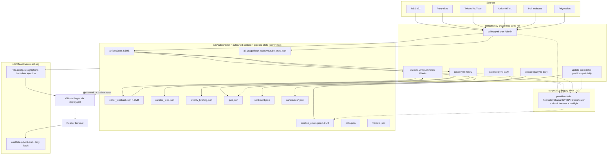

# 01 - Current Architecture (Phase 1 Diagnosis)

Date: 2026-08-23. HEAD `db6b4be1c`. Companion artifacts: `00-baseline.md`, `02-risk-register.md`.

Every claim is tagged **OBSERVED** (verified in files/commands this session) or **INFERRED** (conclusion drawn from observed evidence; reasoning stated). No ASSUMED/UNKNOWN claims are used as foundations; they are called out explicitly.

## 1. System shape

Git is the database and the message bus. Five scheduled GitHub Actions workflows mutate JSON files under `site/public/data/` (OBSERVED, `.github/workflows/*.yml`), commit them to `master`, and a sixth workflow builds a static site from those files and publishes every file under `site/public/` verbatim to GitHub Pages (OBSERVED: `site/dist/data/` contains all 22 entries after build, including operational state files).

## 2. Module responsibilities and dependency directions

### Python pipeline (`scripts/`, ~17.3k LOC)

| Module | Responsibility | Depends on |
|---|---|---|
| `ai_client.py` | LLM provider chain, retries, circuit breaker (`_call_with_fallback_for_task`, ai_client.py:660), TTFT preflight (:381,:438), task-specific chains (:147), usage accounting (`_load_usage`/`_save_usage` :176,:210 writing `site/public/data/ai_usage.json`) | openai SDK, env keys |
| `collect_rss.py` / `collect_parties.py` / `collect_polls.py` / `collect_social.py` / `collect_markets.py` | fetch sources, dedupe by id, write store | requests/feedparser/tweepy, Bright Data REST, optional Playwright |
| `scrape_articles.py` | full-text fetch: Bright Data primary, Playwright/Chrome lazy fallback | Bright Data, Playwright |
| `summarize.py` / `analyze_sentiment.py` | AI validation/summarization/sentiment; status transitions raw→validated; relevance gate writes back into feedback file | ai_client, editor_feedback, sanitize package |
| `curate.py` | prominence scoring, promotion validated→curated, curated_feed + weekly_briefing generation, in-process quiz refresh (`_run_quiz_refresh` → `generate_quiz.main()`, curate.py:526) | ai_client indirectly via generate_quiz |
| `build_data.py` | consolidate articles: dedupe, filter irrelevant, sort, trim 500, schema-validate (warn-only), save | editor_feedback, docs/schemas/articles.schema.json |
| `generate_quiz.py`, `seed_candidates_positions.py`, `extract_positions_from_articles.py` | positions knowledge base + quiz generation/validation against quiz.schema.json | ai_client, jsonschema |
| `sanitize/` (package) | shared constants, TF-IDF dedup (`dedup.cluster_articles_tfidf` lazily imports sklearn at sanitize/dedup.py:92), relevance heuristics | scikit-learn (lazy) |
| `editor_feedback.py` | the only shared module for feedback semantics (`load/save/add_article_id_to_feedback/feedback_reason_for_article`) | none |
| `watchdog.py` | reads 8 store files, writes pipeline_health.json | none |

**Dependency direction** (OBSERVED imports): leaf collectors → store files; enrichers → {store files, ai_client, editor_feedback}; curators → {store files, generate_quiz}. Nothing imports *from* collectors/enrichers except their own tests. Direction is acyclic at module level. INFERRED: the de-facto "shared kernel" is the JSON store itself plus two half-extracted helpers (`editor_feedback.py`, `sanitize/`) — everything else is re-implemented per script.

### Frontend (`site/src`)

- `main.jsx`: i18n init (bundled locale JSON), `ViteReactSSG` callback: server branch reads `public/data/*.json` via node fs into a module store (`loadServerBootData`, main.jsx:24); client branch reads `window.__BOOT_DATA__` injected by `vite.config.js:ssgOptions.onPageRendered` (vite.config.js:71).
- `utils/bootData.js`: tiny sync store (`set/getInitialData`). **Untracked in git while being imported by tracked files** (see Finding F1).
- `hooks/useData.js`: single data-access seam for pages/components; boot-data-first, memory cache, background refresh only for `articles` (useData.js:29-53).
- Pages (11) consume `useData('articles'|'polls'|...)`; no direct fetch elsewhere except case-study markdown (CaseStudyPage.jsx:129) and search index (useSearch.js:65).

Dependency direction: pages → hooks/useData → bootData store → (SSG-injected or fetched JSON). Acyclic, clean.

### Workflows

All five writers share `concurrency: repo-write-${{ github.ref }}` (serializes bot writes per ref, OBSERVED) and each carries a private ~25-line copy of pull→commit→merge/rebase→conflict-resolve→push-retry shell (collect.yml:133-180, validate.yml:55-85, curate.yml:51-76, watchdog.yml:45-70, update-quiz.yml:38-63, update-candidates-positions.yml tail). Two different conflict strategies exist: collect.yml resolves JSON conflicts via `scripts/merge_json.py` then falls back to `git checkout --theirs`; validate.yml auto-continues rebase keeping remote ("theirs") versions.

## 3. Key flows traced

### Flow A - News ingestion → publication (highest value)

1. `collect.yml` cron `*/15 0-3,8-23 * * *` runs `sync_editor_feedback.py` then five collectors (collect.yml:98-107). Non-RSS collectors are `|| echo "[warn]"` best-effort.
2. `collect_rss.collect_articles()` (collect_rss.py:324): loads `sources.json` active feeds + current `articles.json` document + feedback; per source tries Bright Data unlocker first, falls back to direct fetch (:349-362); skips ids already present (:390), feedback-blocked entries (:377), suppresses paywall bodies (:396), near-duplicate fast-path marks new items `irrelevant` with `narrative_cluster_id` (:423-430); appends and saves atomically-per-run (:435-439).
3. `scrape_articles.py --limit $SCRAPE_LIMIT(40)` fills `content` for raw items.
4. `summarize.summarize_articles(limit=12)` (summarize.py:419): gates in order - already-irrelevant (feeds back into feedback file :456), feedback reason (:472), elections-relevance heuristic marking `irrelevant` (:488-501), per-run limit (:505), global circuit-breaker check `_all_providers_unavailable()` (:431), content-integrity validation (:526); then calls `ai_client.summarize_article` producing bilingual `summaries`, `relevance_score`, `candidates_mentioned`, `topics`, appending provider to `edit_history`. Status becomes `validated` on success (INFERRED from curate.py:552 eligibility set `{validated, curated}` and summarize's role as "Editor"; transition code not read line-by-line - confidence high).
5. `analyze_sentiment.analyze_sentiment(limit=12)` batches candidate-level scores → `sentiment.json`.
6. `build_data.consolidate_articles()` (build_data.py:187): id-dedupe, irrelevant-id sync into feedback, drop irrelevant/blocked, sort by `published_at` desc, trim to 500, Draft7 schema validation that only logs warnings and never blocks (:167-184), save wrapped document.
7. `generate_rss_feed.py` (cwd-relative path! see F5) and `archive_articles.py --execute` (hot/warm/cold tiering).
8. Commit/push dance (collect.yml:133-180): stage data, merge `origin/master`, resolve conflicted `*.json` via `merge_json.py` base/theirs merge, unresolved leftovers forced to `--theirs`, push retry x3.

Failure semantics OBSERVED: any collector error is swallowed (warn-and-continue); AI total failure raises `RuntimeError` inside summarize but the workflow step has no `|| true`, so Collect fails red while Validate reruns it later. INFERRED: deliberate eventual-consistency posture; raw items simply wait for next run.

### Flow B - Curation & quiz (engagement value)

1. `curate.yml` hourly runs `python -m scripts.curate` (module form, unlike collectors' file form - see F4).
2. `main()` enforces ≥90 min between runs via `site/public/data/.curate_last_run` (curate.py:586-597).
3. `curate(now)` (curate.py:545): recomputes `prominence_score` for validated/curated (`_compute_prominence` :213), promotes validated above threshold with `curation_history` append; rebuilds `curated_feed.json` (projected article fields :292) and `weekly_briefing.json`; then calls `generate_quiz.main()` in-process (:526-543), recording failures into `pipeline_errors.json`.
4. Standalone `update-quiz.yml` (daily 03:00) also runs `python -m scripts.generate_quiz`: loads `candidates_positions.json` knowledge base, generates topic options via `ai_client.generate_quiz_topic_options` and validates via `validate_quiz_option_quality`, validates output against `docs/schemas/quiz.schema.json` (generate_quiz.py:1-25), writes `quiz.json`.

INFERRED: two independent writers can regenerate quiz.json (curate in-process vs its own workflow); both are inside the same concurrency group so no interleaving, but ownership of the file is ambiguous.

### Flow C - Build & reader delivery (reader-facing)

1. Triggers: push touching `site/**` (every bot data commit qualifies) OR `workflow_run` success of Collect/Validate/Curate (deploy.yml:3-15).
2. `generate_seo_pages.py` best-effort, then `npm ci && npm run build` in `site/`.
3. SSG: routes expanded with hardcoded candidate/comparison slugs (vite.config.js:80-108); each prerendered page gets `` built from small datasets + top-20 articles (vite.config.js:11-40,71-79).
4. Runtime: `main.jsx` client branch seeds `bootData` store from `window.__BOOT_DATA__`; `useData` returns boot data synchronously (no loading flash); only `articles` triggers a silent full-corpus refetch (useData.js:29-53); other datasets are final per session. Non-boot datasets (e.g. `curated_feed`, used by pages beyond the boot list) fetch lazily on mount.
5. Everything under `site/public/` ships to Pages including operational state (OBSERVED `ls site/dist/data` = 22 entries incl. `ai_usage.json`, `fetch_state.json`, `youtube_state.json`, `pipeline_errors.json`, `quiz.json.bak`).

## 4. Findings (ranked by impact × confidence ÷ remediation cost)

| # | Severity | Confidence | Finding | Evidence chain |
|---|---|---|---|---|
| F1 | **Critical** | OBSERVED | Required source file never committed; clean checkouts cannot build the site. `db6b4be1c` added imports of `./utils/bootData` (site/src/main.jsx:15, site/src/hooks/useData.js:3) but `site/src/utils/bootData.js` is untracked (`git log --all -- <file>` empty). Local build succeeded only because the file exists in this working tree. CI Deploy on master is structurally broken since that commit. UNKNOWN: actual Actions status (no logs checked). | git status; git log --all; vite alias table (only `@`) rules out alternate resolution |
| F2 | High | OBSERVED | Operational/internal state is published publicly and bloated: `pipeline_errors.json` (4088 entries, 1.2MB), `editor_feedback.json` (4.3MB), `ai_usage.json`, `fetch_state.json`, `youtube_state.json`, `quiz.json.bak` all live in the public store and ship in every Pages deploy. Consequences: privacy surface (error messages include URLs/snippets; API keys are regex-redacted at curate.py:140 but no such scrubbing verified elsewhere - INFERRED partial mitigation), repo/diff bloat on every bot commit, CDN payload. Root cause: three concerns (published content, pipeline state, audit logs) share one directory that doubles as web root. | ls site/dist/data; wc/du baseline; curate.py:126-159 |
| F3 | High | OBSERVED (code), INFERRED (loss events) | Git-as-DB conflict handling can silently discard freshly computed data. validate.yml:69 keeps `--theirs` (= remote) on rebase conflicts, discarding the outputs just computed in that run; collect.yml:165 does the same as last resort. With 5 writers on one lock, contention is frequent enough (README itself documents queueing tradeoffs) that some computed work is periodically thrown away. No metric counts these events. | validate.yml:63-76; collect.yml:145-170; README "CI execution" section |
| F4 | Medium-High | OBSERVED | Boundary leakage + entry-point duality around `ai_client`. summarize.py:20 imports private internals `_provider_failure_counts`, `_CIRCUIT_BREAKER_THRESHOLD`; execution style is inconsistent (`python scripts/x.py` for collectors vs `python -m scripts.x` for curate/generate_quiz), which forces every module to carry dual-import try/except blocks (summarize.py:19-47 pattern repeated across ≥8 modules). Any refactor of breaker internals must touch consumers that should not know about them. | grep imports; wc of try/except ImportError occurrences |
| F5 | Medium | OBSERVED | Store-path coupling duplicated 13×: each module redefines `DATA_DIR = ROOT_DIR/"site"/"public"/"data"` + file constants; `generate_rss_feed.py:15` alone uses cwd-relative `Path("site/public/data/articles.json")`, which breaks if invoked from another cwd. Renaming/moving the store requires editing 13 modules. | grep DATA_DIR results (68 matches) |
| F6 | Medium | OBSERVED | Unbounded growth files re-serialized every run: `editor_feedback.json` loaded+saved by collect_rss/summarize/build_data/sync each run (4.3MB today); `pipeline_errors.json` append-only, never truncated (4088 entries). Cost grows linearly forever: CI minutes, git object size, deploy size. Archive policy exists for articles only. | du baseline; curate.py:_append_pipeline_error; archive_articles.py scope |
| F7 | Medium | OBSERVED | Drift cluster from the store having moved to `site/public/data`: README architecture diagram still says root `data/*.json`; vite.config.js:8 dev proxy serves `/data` from nonexistent repo-root `data/` (dev-mode data fetch broken or accidental); dead `pyproject.toml` stub ("Add your description here"); dead `main.py`; 22 tracked playwright-session YAMLs at root. Shared root cause: relocation cleanup never happened. | README.md:45; vite.config.js:8,60-64; ls |
| F8 | Low-Medium | OBSERVED | Test-suite split brain: `tests/test_seed_candidates_positions.py` (372 lines, "Sources E & F") vs `scripts/test_seed_candidates_positions.py` (130 lines) - two divergent suites for one module; nobody owns which is authoritative. Also local env cannot install sklearn/playwright/google-cloud (Termux), so contributors on constrained machines run a blind subset. | diff; pytest output in 00-baseline |
| F9 | Low | OBSERVED | Domain knowledge hardcoded in frontend routing: candidate slugs + comparison pairs listed twice in vite.config.js:81-101, duplicating `candidates.json` content; adding a pre-candidate silently produces no SEO pages until manual edit. | vite.config.js includedRoutes |

## 5. Explicit non-problems (look odd; do not change)

1. **Colocated `scripts/test_*.py`**: works with pytest, matches README test command. Keep.
2. **Dual-import try/except blocks**: ugly but functional support for both execution styles; unify only when entry points are unified anyway.
3. **`repo-write-${{ github.ref }}` coarse lock**: correct protection given git-as-DB; README documents the queueing tradeoff and the alternative design cost. Keep until a real store exists.
4. **Bright Data primary + Playwright fallback**: deliberate cost/anti-blocking design (README). Do not invert.
5. **In-memory per-process circuit breaker** (`_provider_failure_counts` resets each run): matches short-lived CI job model. Not a bug.
6. **Boot-data inline mechanism itself** (vite.config onPageRendered + useData): sound performance design with correct SSR/client symmetry; the only defect is F1 file tracking.
7. **Warn-and-continue collector steps** in collect.yml: availability-over-correctness choice appropriate for 15-min cadence; failures land in watchdog/pipeline_health instead.
8. **`merge_json.py` union-merge strategy** in collect.yml: reasonable default for append-mostly arrays; risk is bounded by F3 analysis, not by the merger itself.

## 6. Symptoms vs root causes

- Symptom: "deploy may be red", "dev proxy broken", "README wrong", "13 copies of paths". Root cause: **the data store lives inside the web root and its location/ownership was never abstracted** (F1, F2, F5, F7 share this).
- Symptom: "AI refactor is scary". Root cause: **ai_client exposes internals and has exactly one real seam** (`call_with_fallback`/task chains) while consumers reach past it (F4).
- Symptom: "JSON conflicts feel dangerous". Root cause: **no writer ownership per file** (two writers for quiz.json, three for articles.json-adjacent fields) plus lossy last-resort resolutions (F3).
