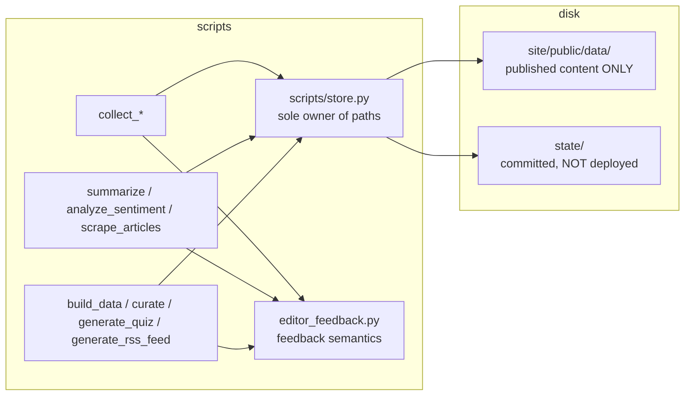

# 03 - Target Architecture (Phase 2)

Date: 2026-08-23. Inputs: `00-baseline.md`, `01-current-architecture.md` (findings F1-F9), `02-risk-register.md` (R1-R10).

## 1. Decision framing

The dominant, evidenced costs in this repository are **operational**, not structural:

| Cost | Evidence | Class |
|---|---|---|
| Broken clean builds | F1: untracked `bootData.js` imported by tracked code | operational/defect |
| Internal state on public CDN + multi-MB diffs every bot run | F2: 22 entries in `site/dist/data`, incl. 4.3MB feedback, 1.2MB errors | operational |
| Silent discard of computed work during conflicts | F3/R3 | operational |
| Path constants duplicated 13x; one cwd-relative outlier | F5: 68 grep matches | code hygiene |
| Unbounded file growth vs 25-min workflow timeout | F6/R6 | operational |
| ai_client internals imported by consumers | F4: summarize.py:20 | boundary hygiene |

Nothing observed demands new infrastructure: no server, no database, no queue, no framework change, no monorepo tooling. The transparency model (everything auditable in-repo) is a stated product surface (README; ADR-006) and rules out moving the store off git today.

## 2. Options considered

### Option A - "Consolidation" (minimal-change)

Keep: script-per-stage pipeline, git-as-database, colocated tests, React SSG frontend, all seven workflows and schedules.
Change only:
1. One shared path module (`scripts/store.py`) replacing 13 private copies (F5).
2. Split store directory by concern: `site/public/data/` = published content only; new committed-but-not-deployed `state/` = operational state (F2).
3. Retention/pruning for unbounded files (F6).
4. Single composite GitHub Action for the 5 duplicated commit/sync blocks (F3 surface area).
5. Single-writer ownership per output file (R8).
6. Hygiene: README drift, dead manifests, junk YAMLs (F7).

### Option B - "Staged pipeline package" (structural)

Option A plus: reorganize `scripts/` into `pipeline/{collect,enrich,publish}` subpackages, unified CLI (`python -m pipeline <stage>`), explicit inter-stage APIs, import-lint enforcement, dual-import blocks deleted.

### Option C - "Externalize the store"

Move article/poll state out of git into a real store (DB or object storage/API). Eliminates F3/F6 root causes entirely.

## 3. Challenging the tempting choice

My staff-engineer reflex favors Option B: real packages, enforced boundaries, tidy entry points. Where does B **increase** complexity?

1. **Import churn vs. test patch points.** 19 test modules monkeypatch module attributes (`monkeypatch.setattr(collect_rss, "DATA_DIR", ...)` - OBSERVED in test_curate/test_collect_polls/test_collect_parties/test_collect_markets). Moving modules invalidates patch targets; each step risks green-tests/wrong-prod mismatches unless every patch site is re-verified. That is pure risk with zero user-visible gain.
2. **Governance machinery without governors.** Import-linter config, package API rules, and layer checks need a maintainer. Git authorship: 159 human commits vs 7049 bot commits, one human identity family (OBSERVED). Solo-maintainer repos pay enforcement costs forever for benefits that scale with team size.
3. **It doesn't touch the actual cost table.** None of B's mechanics reduce F1-F3, F5-F7 beyond what A already does. B is aesthetics where the pain is operations.
4. **Migration blast radius.** B touches ~40 modules + ~19 test files at once-ish; A's largest step touches ~13 modules mechanically.

Where B *would* win (and therefore what we keep cheap): a stable internal seam named for growth. A adopts `scripts/store.py` as that seam - if B ever becomes justified, `store.py` graduates into `pipeline/core/store.py` with callers unchanged except import lines.

**Option C rejected** on product evidence: transparency/auditability-in-repo is a documented product requirement (README "auditable editorial infrastructure", ADR-006); C breaks it and adds hosting/auth/backup obligations. Revisit triggers defined in §6.

**Selected: Option A.** B and C recorded as future options with explicit upgrade thresholds.

## 4. Target architecture (Option A, concretized)

### 4.1 Boundaries

- **Published content whitelist** (`site/public/data/`): articles.json, archives/, candidates.json, candidates_positions.json, candidates_positions_draft.json, curated_feed.json, donors.json, markets.json, pipeline_health.json, polls.json, quiz.json, sentiment.json, sources.json, tse_data.json, transparencia_data.json, weekly_briefing.json, feed*.xml. Enforced by a whitelist pytest (M2).
- **Operational state** (`state/`, committed for auditability, never deployed): ai_usage.json, fetch_state.json, youtube_state.json, .curate_last_run, editor_feedback.json*, pipeline_errors.json*.
  - *editor_feedback.json moves only if no consumer exists (verified: zero references in site/src, locales, ADRs - OBSERVED grep). Residual UNKNOWN: third parties scraping old URLs; consequence accepted (static host cannot redirect); documented in ADR.
  - pipeline_errors.json additionally gets rotation (cap N=500 newest, monthly archive under state/archives/) after redaction coverage audit (R10) passes.
- **Ownership map (single writer per file)**:

| File | Writer workflow(s) | Change |
|---|---|---|
| articles.json (+sentiment, curated_feed, weekly_briefing) | Collect then Validate then Curate (stage-sequential under global lock) | unchanged |
| quiz.json | Curate (in-process refresh) | update-quiz.yml becomes manual-only dispatch OR removed (owner decision flagged in M7) |
| candidates_positions*.json | update-candidates-positions.yml | unchanged |
| pipeline_health.json | Watchdog | unchanged |
| editor_feedback.json | Collect (sync step) reads/writes; enrichers mutate within their own run | unchanged semantics |

### 4.2 Allowed dependency directions

- collectors/enrichers/publishers -> {store.py, editor_feedback.py, sanitize/, ai_client}. Never sideways between stages.
- No module imports underscore-private names of another module (kills F4 reach-in). Public surface of ai_client: task functions (`summarize_article`, `extract_candidate_position`, `extract_candidate_topic_position`, `generate_quiz_topic_options`, `validate_quiz_option_quality`, `call_with_fallback`, preflight entry).
- Frontend: pages/components -> hooks/useData only; bootData store fed solely by main.jsx/vite.config injection pair.
- vite.config.js route expansion must derive from data (candidates.json) or from one generated constant, not hand-maintained lists (addresses F9 minimally: generate the JS constant from candidates.json in postbuild/prebuild script - small, reversible).

### 4.3 Data & error flows (unchanged externally)

Status machine raw->validated->curated, irrelevant filtering, trim-500, warn-only schema validation: preserved as-is in this target. Error flow: failures land in pipeline_errors.json (redaction mandatory at every writer - R10 audit closes gaps) and watchdog surfaces health. No behavior change intended by this target; it relocates state, deduplicates code, and adds retention.

### 4.4 Observability requirements

1. Watchdog extends pipeline_health.json with: `merge_conflicts_resolved`, `writes_discarded_by_theirs` (workflows echo counters into a machine-readable line watchdog parses), `pruned_counts` per file, `store_sizes` (bytes of top-level JSONs).
2. Every bot commit message keeps existing conventional format (deploy/notify compatibility preserved).
3. CI job duration logged per stage (already implicit in Actions UI; no extra tooling).

## 5. What we deliberately do NOT build

No DB/server/queue (C), no package split (B), no TypeScript, no test-framework consolidation, no schema-validation hard-blocking (needs product decision + error-budget design; kept advisory, R7 documents honestly), no i18n/framework changes.

## 6. Upgrade thresholds (when to revisit)

- **A -> B**: any two of: >60 pipeline modules; >=2 recurring human contributors to scripts/; second programmatic consumer of pipeline stages appears.
- **A/C hybrid (state off-git, content stays)**: any of: workflow timeout breaches traced to git sync; conflict-discard counter (§4.4) shows recurring loss; repo clone size degrades contributor experience measurably (>~1GB).
